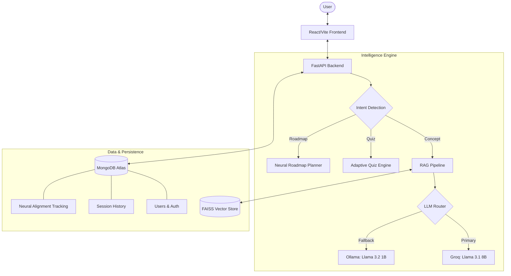

# 🎓 MentorOS — Context-Aware AI Learning Mentor

**Team Members:**
- MONIKA-24BDS043
- Pujari Vanaja Sudha-24BDS059
- Rithika S-24BDS067
- Thota Veda Priya-24BDS084


An intelligent, personalized AI mentor that goes beyond a basic chatbot by combining **RAG (Retrieval-Augmented Generation)**, **adaptive quizzes**, **study planning**, and **interactive teaching modes**.

> Built for real learning — not just answering questions.

---

## 📽️ Video Presentation

Click below to watch the video demonstration of MentorOS in action:

[🎬 Watch Presentation Video](./demo/ai-mentor-demo.mp4)

---

## 🏗️ Architecture Overview

MentorOS uses a sophisticated, multi-layered architecture designed for high availability and hyper-contextual learning.



---

## 🚀 Features

### 🧑‍💻 1. Smart AI Chat (Intent-Driven)
- **Dynamic Intent Detection**: Automatically categorizes queries into concepts, planning, quizzes, or motivation.
- **Hyper-Contextual RAG**: Uses **sentence-transformers/all-MiniLM-L6-v2** to retrieve precise context.
- **Fallback Resilience**: Seamlessly transitions from **Groq (Cloud)** to **Ollama (Local)** if disconnected.

### 🧠 2. Adaptive Assessment Engine
- **Difficulty Scaling**: Quizzes adjust in real-time based on your previous 3 attempts (Easy/Medium/Hard).
- **Format Variety**: MCQs with detailed, material-based explanations.
- **Score Persistence**: All results are saved to your neural alignment profile for long-term tracking.

### 🎓 3. "Be My Student" Mode (Teacher Mode)
- **The Protege Effect**: AI acts as a student, forcing the user to explain complex topics — the most effective way to learn.
- **Interactive Roleplay**: AI asks probing questions and makes common mistakes for the user to correct.

### 📉 4. Neural Link Tracker & Study Plans
- **Progress Insights**: Visualization of learning patterns and topic mastery.
- **7-Day Roadmaps**: Generated study plans including specific tasks, learning steps, and revision cycles.

---

## 🛠️ Tech Stack

### Frontend
- **React 18 (Vite)**
- **Tailwind CSS** (Modern dark-mode aesthetic)
- **Lucide Icons** & **Mermaid.js**

### Backend (The Brain)
- **FastAPI**: Asynchronous high-performance API.
- **LangChain**: RAG orchestration and chain-of-thought processing.
- **FAISS**: Local, high-speed vector database per user.
- **PyPDF2 + EasyOCR**: Advanced document and image ingestion.

### AI Models & Storage
- **Groq API**: Primary LLM (Llama 3.1 8B) for 200+ tokens/sec.
- **Ollama**: Local containerized fallback for privacy and availability.
- **MongoDB Atlas**: Global persistence for users and activity telemetry.

---

## ⚙️ Robust Fallback Ecosystem (IMPORTANT)

MentorOS is designed to never block a learning session:
1.  **Level 1 (RAG + Groq)**: Context-aware answers via the fastest cloud LLM.
2.  **Level 2 (General Groq)**: Falls back to general knowledge if the material is insufficient.
3.  **Level 3 (Local Ollama)**: If cloud services fail, the system activates the local `llama3.2:1b` model.

---

## 📦 Installation

### 1. Prerequisites
- **Python 3.10+**
- **Node.js 18+**
- **MongoDB Atlas** account (or local MongoDB)
- **Groq API Key** (Free tier available)
- **Ollama** (Optional, for local fallback)

### 2. Backend Setup
```bash
cd backend
python -m venv venv
# Windows:
.\venv\Scripts\activate
pip install -r requirements.txt
# Start server:
uvicorn app:app --reload
```

### 3. Frontend Setup
```bash
cd frontend
npm install
npm run dev
```

---

## 🔑 Environment Variables

### Backend (`backend/.env`)
```env
MONGO_URI=your_mongodb_atlas_uri
JWT_SECRET=your_jwt_signing_key
GROQ_API_KEY=your_groq_key_here
```

### Frontend (`frontend/.env`)
```env
VITE_API_BASE_URL=http://localhost:8000
```

---

## 📄 License
This project is for educational purposes.

**Made with ❤️ for students, by students.**